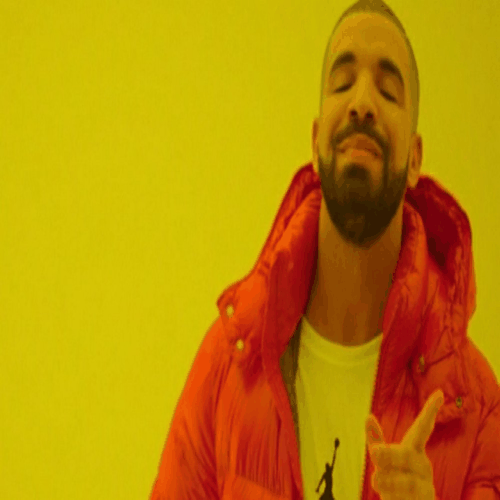

# 🎬 Drake GIF Generator

A lightweight Python project that automatically handles color profile conversion and frame resizing to compile source images into a seamless, animated GIF loop.

## 🚀 Live Demo



## 🛠️ Tech Stack & Features

- **Language:** Python 3
- **Libraries Used:** `imageio`, `Pillow (PIL)`, `NumPy`
- **Error Resolution:** Automatically solves the common `ValueError: all input arrays must have the same shape` error by stripping transparent alpha channels and forcing an RGB layout.
- **Auto-Resizing:** Standardises all input frames to a perfect 500x500 pixels canvas before compilation.

## 💻 How to Setup and Run

### 1. Install Dependencies
Open your terminal or PowerShell and install the required Python packages:

```bash
pip install imageio numpy pillow
```

### 2. Navigate to Project Directory
Switch to the directory where your script and images are saved:

```powershell
D:
cd D:\Kanishka\Personal\projects\create-gif\.github
```

### 3. Run the Script
Execute the Python script to rebuild or update the GIF:

```powershell
python create-gif1.py
```

## 📄 License

This project is licensed under the MIT License - see the [LICENSE](LICENSE) file for details.
